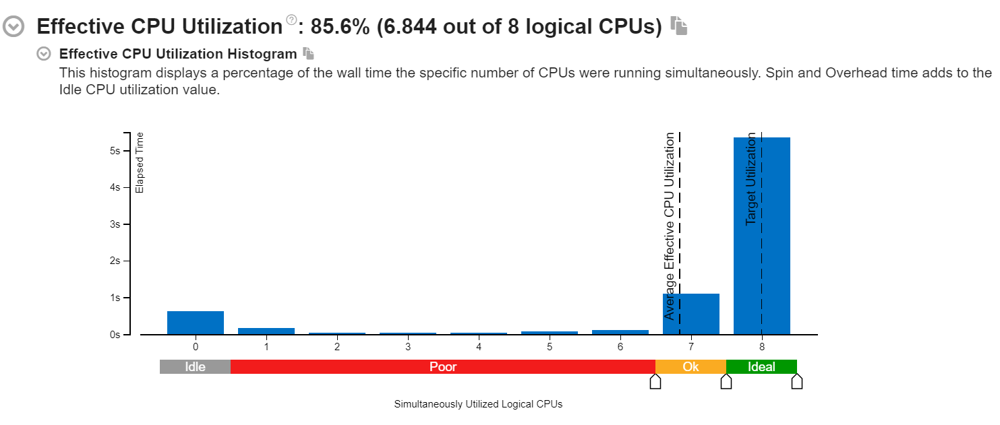
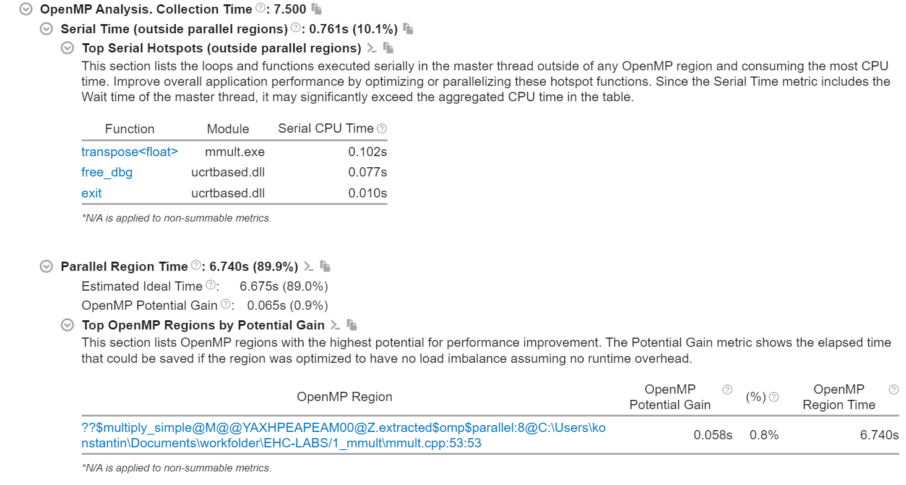
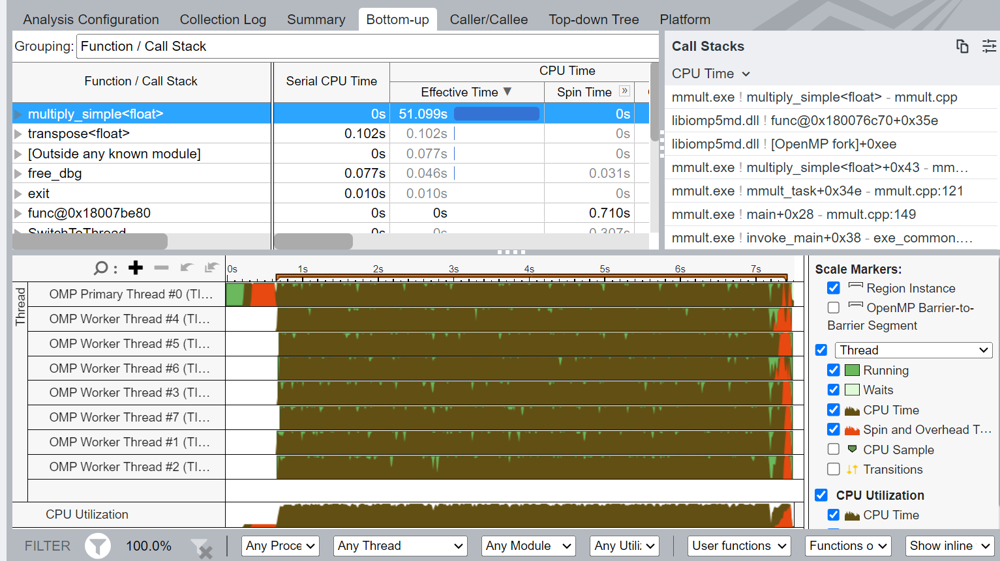
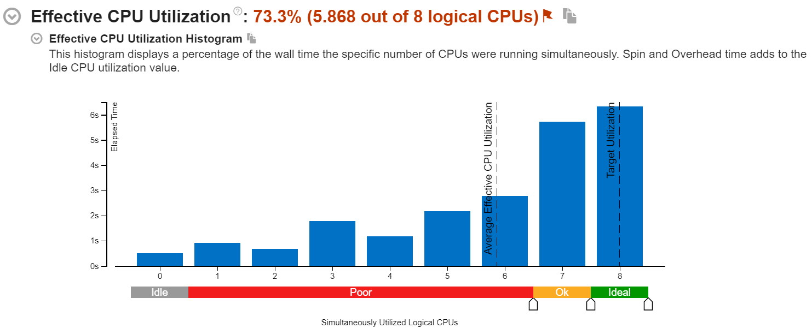
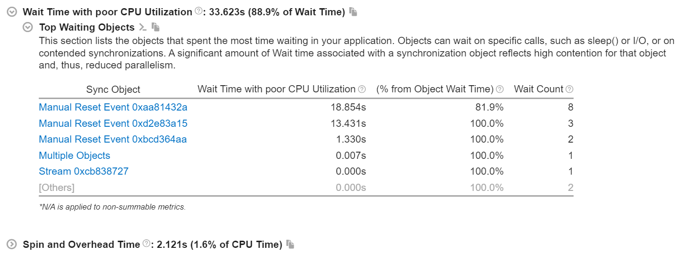
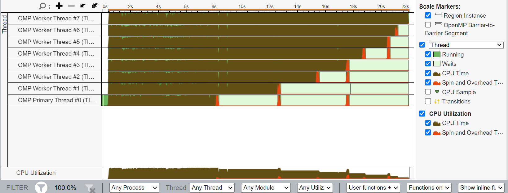
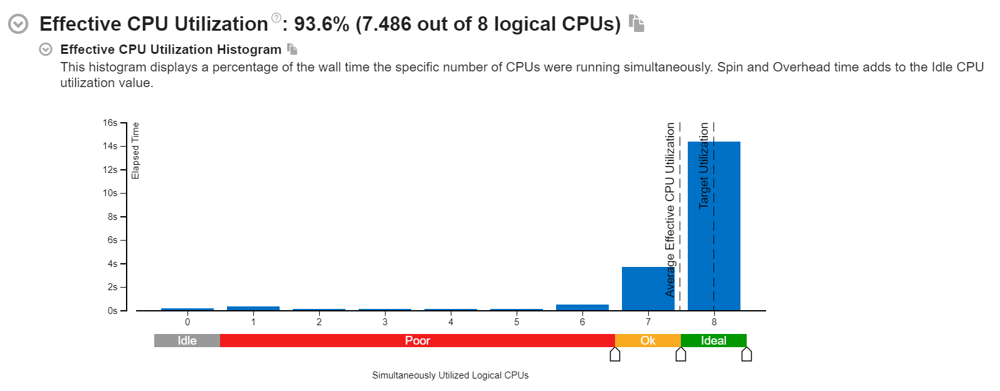
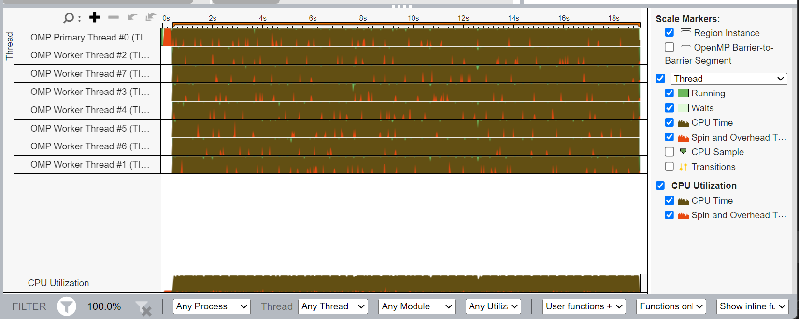

## План работы

Для данного мастер класса потребуется собирать и запускать 2 приложения:
- mmult (1_mmult)
  Задача по нахождению результата выполнения операции матричного умножения для двух матриц размерности N\*N, где N - аргумент, который можно задать при запуске приложения, по умолчанию - 1024.
- primary_nums (6_primary_nums)
  Задача по нахождению всех простых чисел из диапазона 2:N, где N верхняя граница рассматриваемого множества натуральных чисел.

В рамках данного мастер-класса необходимо будет:
1) Изучить прилагаемый документ по основам использования программной модели OMP, способы создания параллельных регионов, распределения работы между потоками и методы по защите разделяемых данных.
2) Использовать OMP  директивы препроцессора для создания параллельной версии mmult.
4) Проанализировать эффективность параллельной версии перемножения матриц с использованием инструмента Intel VTune, сделать вывод по результатам анализа
5) Проанализировать эффективность параллельной версии приложения по нахождению множества всех простых чисел на заданном диапазоне
6) Применить модификации простейшего решения в случае, если удается обнаружить проблему в производительности
7) Сравнить две реализации, сделать выводы

- [Настройка окружения](/tutorials/Настройка%20окружения.md)
- [Введение в OpenMP](/tutorials/Введение%20в%20OpenMP.md)

## Рекомендации по выполнению работы

Для успешного выполнения работы необходимо ознакомиться с документами выше.
Добавление параллельных регионов возможно только в тех местах (например, в циклах, где каждая итерация будет исполняться в параллель т.е. будет параллельной задачей), где нет зависимостей между параллельными задачами. Определить это поможет уже изученный на предыдущих занятиях инструмент - Intel Advisor и его [Dependencies Analys](/tutorials/Анализ%20зависимостей%20в%20Intel%20Advisor.md)

Потенциальный прирост производительности за счет распараллеивания можно узнать при помощи запуска Suitability анализа, который выполняли на МК2.

Последовательность запусков:
- Проверка корректности работы программы: запуск небольшой по размеру задачи, сравнение с эталонным значением
- Запуск последовательной версии на большой задаче (большее значение входного аргумента)
- Добавление параллелизма, сравнение времени выполнения и результатов работы с последовательной версией
- Анализ параллельного приложения в VTune, оценка эффективности.

## Анализ в VTune

### Настройка окружения для oneAPI toolkit инструментария

Для корректного выполнения анализа OpenMP приложений в Intel oneAPI VTune рекомендуется запустить командную строку **cmd** и из нее выполнить настройку окружения через запуск скрипта:

`"D:\Program Files\oneAPI\setvars.bat"`

далее в этой же командной строке необходимо запустить и VTune:

`vtune-gui`

и открыть VSCode

`code`

### Mmult

Для того чтобы выполнить анализ производительности параллельного OMP приложения в Intel VTune, необходимо создать в нем новый проект (New Project)

Далее все стандартно: выбираем место для сохранения проекта, название проекта, анализируемое приложение и аргументы для него (mmult с >= 4000 размерностью матриц)

Далее в **Performance Snapshot**

Необходимо выбрать **Threading** анализ

И запустить его.

В собранном результате первым делом необходимо обратить внимание на **Summary** страницу.

На ней представлена информация об эффективной утилизации CPU. Это столбчатая диаграмма, на которой сумма длин всех столбцов будет показывать **Elapsed time** - это время от старта программы до ее завершения, то есть, без учета того, сколько каждый поток времени отработал по отдельности.

Если же взять в учет кол-во потоков для каждого столбца, и домножить эти значения на временные велечины для этих столбцов, то мы получим уже **Total time**.

Собственно, смысл этого графика показать, какую долю от всего времени программы (от Elapsed time) мы в полную меру утилизировали все доступные физические потоки.

Далее приведена статистика непосредственно по OMP модели

Поскольку собирали мы приложение с компилятором от Intel, он при генерации OMP кода вставил свою отладочную информацию, по которой в дальнейшем профилировщик смог определить, когда происходит процесс создания параллельного региона, а когда выполняется последовательный участок программы. Это **parallel** и **serial** блоки.

Далее следует общая статистика утилизации CPU, сколько времени он крутился в активном ожидании (spin and owerhead), либо же ожидал каких-то событий, но не занимал процессорное время. Это все так же доступно и для OMP специфичных задач по созданию потоков, их синхронизации.

#### Summary

Для данного примера MMULT приложения (отмечу, на большом размере задачи, когда доля последовательной части уже не так велика), мы имеем очень хороший случай отлично распараллеливаемой задачи. Так же стоит отметить, что при росте сложности самой задачи, доля параллельного региона только растет, и он легко занимает всю доступную ширину вычислительных возможностей (все доступные ядра). Пример хорошо масштабируемой задачи.

**Дополнительное задание:** 
посмотреть на соотношение serial/parallel частей анализируемого приложения на разных размерах задачи по перемножению матриц (разная размерность самих матриц, например от 10 до 1000).

На **Bottom-up** вкладке можно обратить внимание на временной график утилизации CPU, там тоже все замечательно:

### Prime numbers

В данном примере уже получается картина интереснее

Поскольку работа по итерациям распределена не равномерно (последние для большего N работают дольше), то и при статическом распределении задач по процессорам мы получим простои на тех ядрах, на которые назначали первые итерации.

Тут же возрастет Wait time, как раз из-за того, что менее загруженные потоки будут ожидать завершения остальных потоков:

Картина в bottom-up говорит то же самое

Поэтому тут в OMP директиве нужно указать, чтобы он попытался распределять задачи динамически:

`#pragma omp parallel for  schedule(dynamic) reduction(+:sum)`

И вот тогда уже процент эффективности использования многопоточной системы будет гораздо выше

